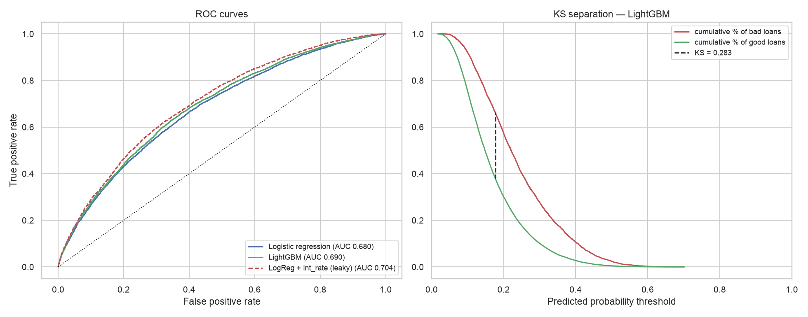
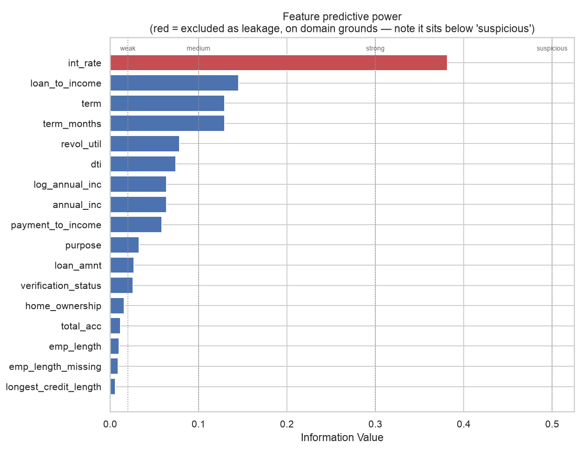
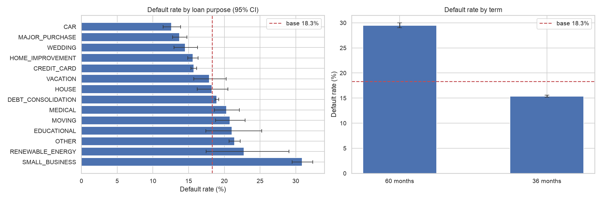
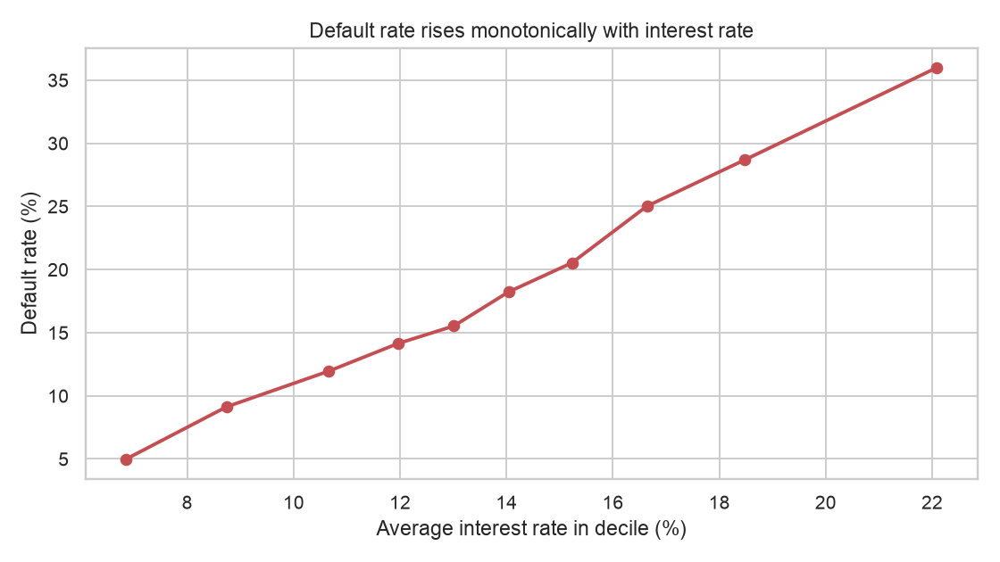
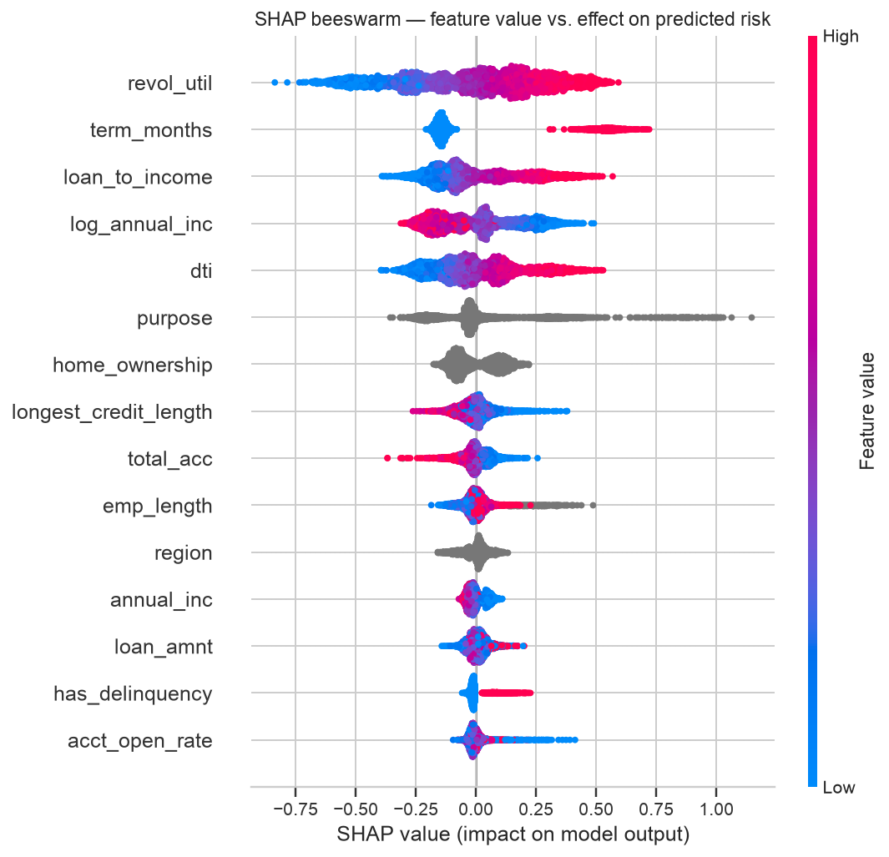
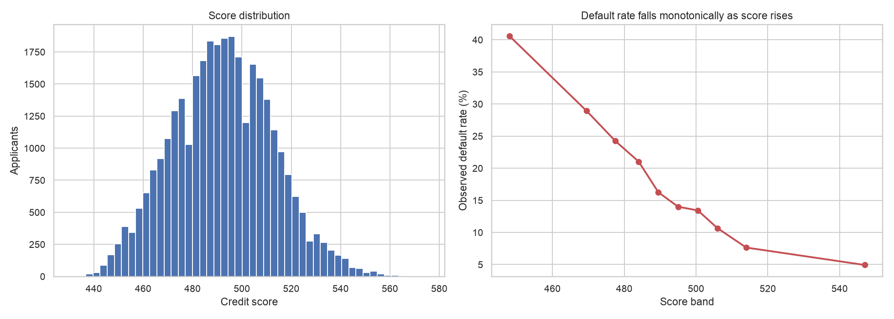

# Credit Risk Scorecard: Lending Club Default Prediction

### ▶ [**Try the live demo**](https://credit-risk-scorecard-9skv.onrender.com)

Score an applicant and see the reasons behind the decision. Free hosting, so
the first visit after a quiet spell takes about 50 seconds to wake.

Predicting loan default from application data, built to demonstrate credit risk
modelling, **rigorous data preparation**, and explainability.

The emphasis throughout is on *defensible* decisions rather than maximum
accuracy. Every cleaning step traces to documented evidence, every claim is
tested rather than assumed, and the results below include the ones that came
out worse than hoped.

---

## Headline results

| Model | AUC | Gini | KS | Brier |
|---|---|---|---|---|
| Logistic regression (baseline) | 0.680 | 0.361 | 0.265 | 0.140 |
| **LightGBM** | **0.690** | **0.381** | **0.283** | **0.139** |
| Logistic regression *with* `int_rate` | 0.704 | 0.408 | 0.299 | 0.137 |

5-fold CV on the baseline: **0.677 ± 0.004**, so the estimate is stable.

Trained on a 60/20/20 train/validation/test split. Early stopping watches the
validation fold, so the test fold was touched exactly once.

The third row is a **leakage control, not a result.** See "The `int_rate`
decision" below.



*Left: all three models, including the leaky variant (dashed) for reference.
Right: KS is the widest gap between the cumulative good and bad distributions.*

**Scorecard:** probabilities convert to a 300–850 score whose default rate
falls monotonically across all ten population deciles, from **40.0%** in the
worst band to **5.2%** in the best, roughly an 8x risk gradient.

---

## The data

163,987 Lending Club loans, 15 columns, **18.3% default rate**.

Because positives are 18.3%, a model predicting "everyone repays" scores 81.7%
accuracy while being useless. **Accuracy is never reported in this project.**
AUC, KS and Brier are used instead.

---

## Project structure

```
credit-risk-scorecard/
├── data/
│   ├── lending_club_raw.csv        # untouched source
│   └── lending_club_clean.csv      # 24 cols (15 raw + 9 engineered), created by notebook 02*
├── notebooks/
│   ├── 01_explore.ipynb            # Phase 2: profiling
│   ├── 02_clean_features.ipynb     # Phase 3: cleaning & features
│   ├── 03_eda.ipynb                # Phase 4: EDA, WoE/IV
│   ├── 04_modelling.ipynb          # Phases 5-8: models, SHAP, scorecard
│   ├── 05_scorecard.ipynb          # Phase 9: WoE points table
│   └── src/                        # percent-format .py source of each notebook
├── outputs/
│   ├── figures/                    # 13 generated charts
│   ├── html/                       # rendered copies of each notebook
│   ├── models/                     # serialised models + scorecard config (committed)
│   ├── model_results.csv
│   └── scorecard_points.csv        # the deployable points table
├── .streamlit/config.toml          # theme and headless mode
├── render.yaml                     # one-click deploy blueprint
├── app.py                          # Phase 10: Streamlit demo
├── requirements.txt                # runtime dependencies only
├── requirements-dev.txt            # notebook dependencies
├── INTERVIEW_PREP.md               # discussion notes for this project
└── README.md
```

Run order: notebooks 01 → 05. Notebook 02 writes the clean CSV that 03 and 04
depend on.

\* Not committed, since it is regenerated by notebook 02 in seconds. The
trained models **are** committed, so `app.py` runs immediately after a clone
with no notebook execution required.

`notebooks/src/` holds each notebook in percent-format `.py`: the same content
as the `.ipynb`, but reviewable and diffable in git, which JSON notebooks are
not. `python notebooks/src/build.py <src.py> <out.ipynb>` regenerates a
notebook from its source.

---

## Phase 2: Profiling: what the data actually contained

Profiling produced a numbered list of problems with evidence attached, so that
every Phase 3 action could point at a reason.

**The most important finding: `emp_length` missingness is not random.** The
5,804 applicants with no employment length default at **26.3%** versus **18.0%**
for those with it, a 1.46x lift, Fisher exact p < 0.001.

A routine `fillna(median)` would have erased that signal entirely, making these
applicants look average. Instead they get an explicit flag.

**Significance was tested, not eyeballed.** Five other columns showed apparent
lifts too: `revol_util` missing rows default at 22.3%. But on 193 rows that is
not distinguishable from chance (p = 0.16). Fisher exact tests on all six
columns confirmed **only `emp_length` carries real signal**, so exactly one flag
was built rather than six spurious ones.

Other findings: three columns are missing on the *same* 29 rows (one block of
records with no bureau data, not three separate problems); `annual_inc` skew is
35.5; categoricals were tested for formatting inconsistency and are clean; and
there are **zero duplicate rows**, so `drop_duplicates()` correctly does not
appear in the pipeline.

---

## Phase 3: Cleaning: decisions and rejected alternatives

| Finding | Decision | Why not the obvious alternative |
|---|---|---|
| `emp_length` missing, non-random | Impute **+ flag** | A plain `fillna` erases a 1.46x risk signal |
| Trace missingness (4–193 rows) | Median, no flags | Apparent lifts failed significance testing |
| `term` stored as text | Regex parse + assert | A dict lookup breaks silently on a new product |
| `revol_util` > 100 (max 150.7) | **Keep uncapped** + flag | Clipping destroys the ordering carrying the signal |
| `annual_inc` skew 35.5 | Add `log_annual_inc` | Dropping outliers deletes real applicants |
| 50 `addr_state` levels | Map to 4 Census regions | Target encoding would leak the label |
| Rare `home_ownership` levels | Collapse to `OTHER` | A 1-loan dummy is memorisation, not learning |

**On `revol_util` above 100%:** these looked like a data error at first, so I
investigated. They are 289 rows clustered tightly between 100.1 and 150.7, not
scattered the way a units error would be, and they default at **25.6%** against an 18.3% base.
There is a real mechanism (interest and fees pushing a balance over its limit),
so they are genuine and informative. Capping them to 100 would have flattened
the most distressed borrowers onto the same value as merely maxed-out ones.

**Nine engineered features**, each from domain reasoning: `loan_to_income` and
`payment_to_income` (affordability), `acct_open_rate` (credit-seeking
velocity), `log_annual_inc` (linear-model conditioning), `has_delinquency`
(robust binary from a sparse count), `over_limit`, `emp_length_missing`,
`term_months`, `region`.

**Imputation is deliberately *not* in the clean CSV.** Only row-wise
deterministic transforms happen in Phase 3; anything that learns a value from
the data (medians, encoder categories) is fitted inside the Phase 5 pipeline
on the training fold only. The clean file still contains `NaN`s by design. This
also lets LightGBM use its native missing-value handling, which learns a
direction per split and beats median filling.

**15 automated validation checks** gate the save. One of them caught a real
error during development: derived features inherit missingness from their
inputs (`loan_to_income` is null wherever `annual_inc` is), so the correct test
is not "no nulls" but **"missing exactly where its inputs are missing"**.
Inheriting missingness is fine, inventing it is a bug.

---

## Phase 4: EDA: Weight of Evidence / Information Value

IV is the standard screening tool in scorecard work. It handles categoricals
natively and catches non-monotonic relationships that correlation misses.

| Feature | IV | |
|---|---|---|
| `int_rate` | 0.382 | strong, *excluded (see below)* |
| `loan_to_income` | 0.145 | **best legitimate feature** |
| `term` / `term_months` | 0.129 | medium |
| `revol_util` | 0.079 | weak |
| `dti` | 0.074 | weak |
| `region` | 0.001 | not predictive |



*`int_rate` (red) dominates, but note it falls short of the 0.5 "suspicious"
line. The heuristic alone would not have flagged it.*

**The engineered features are a mixed result, reported honestly.**
`loan_to_income` is the single best non-leaky feature in the dataset, beating
every column it was built from. But `payment_to_income` **underperformed**
(0.058): dividing by term folded a strong variable into the ratio and blurred
it. Three features (`acct_open_rate`, `has_delinquency`, `over_limit`) score
below 0.02 and are kept only for the tree model.

**Significance ≠ importance.** `emp_length_missing` is highly significant *and*
low-IV (0.009). Both are correct: the Fisher test asks "is the effect real?"
(yes, emphatically); IV asks "how much does it move the whole portfolio?" (not
much, since it fires on 3.5% of applicants). A large effect on a small group is
exactly this. The flag is kept because it sharpens judgement on the applicants
it fires for, but it is not expected near the top of a global importance chart.



*Small business lending is the riskiest purpose, and 60-month loans default at
roughly twice the 36-month rate. The confidence intervals show which thin
categories are not actually distinguishable from the base rate.*

**A second, subtler process artefact.** Verified applicants default *more*
(20.1%) than unverified ones (15.2%), which reads backwards until you look at
what they borrow: median loan **$14,000 vs $8,900**, and 29.6% take the 60-month
term versus 5.1%. Lending Club *chose to verify the riskier applications*. So
`verification_status` partly encodes the lender's own suspicion rather than a
borrower property. Weak enough to keep, important enough to flag before anyone
reads a SHAP plot and concludes verification causes default.

---

## The `int_rate` decision

Keeping or dropping `int_rate` is the biggest single decision in the project,
so it gets its own section.

**Evidence it leaks:** default rate rises perfectly monotonically across all ten
interest-rate deciles, from ~5% to ~36%. Nothing in real credit data is that
clean by accident. The mechanism is known: Lending Club ran their own risk
model at origination and *set the rate from it*. `int_rate` is a downstream
summary of a risk assessment that already happened, not something the applicant
brought to the application.



*Ten out of ten deciles in order, from ~5% to ~36%. Real borrower behaviour is
never this tidy. This is the shape of a variable derived from a risk model.*

**Worth noting what the evidence is *not*.** `int_rate`'s IV of 0.38 sits
*below* the 0.5 threshold that the credit-risk rule of thumb reserves for
suspected leakage. **The heuristic does not catch this.** Domain knowledge of
the data-generating process is what catches it; IV only corroborates that the
column is unusually dominant. A threshold is a prompt to investigate, never a
verdict, and reporting that honestly matters more than making the rule of
thumb look prescient.

**Decision: exclude it, and quantify the cost.** It is worth 2.4 AUC points
(0.680 → 0.704). That gain is not predictive skill and cannot be used anyway:
scoring a new applicant would require their interest rate, but the rate is set
*from* the risk assessment. The input does not exist at decision time.

Reporting both numbers is the honest form of the decision. Silently dropping
the column would hide the most interesting trade-off in the project.

---

## Phases 5–6: Modelling

**Multicollinearity was checked with VIF, and the first attempt failed.**
`total_acc` and `acct_open_rate` both exceeded the threshold. That is unsurprising in
hindsight, since `acct_open_rate` was *defined* as `total_acc / (longest_credit_length + 1)`.
Phase 4's pairwise correlation scan (|r| > 0.7) missed it because the
relationship sits just below that line. `acct_open_rate` was dropped from the
linear set (it also had the lowest IV in the set); all VIFs then fell below 5.

A subtlety worth recording: VIF had to be computed on **imputed** data. Using
`dropna()` removes every row where `emp_length` is missing, which is exactly the
population where `emp_length_missing` equals 1, turning the flag into a
constant column and returning `NaN`.

**The two model families get different feature sets, deliberately.** Logistic
regression gets a curated, decorrelated set because unstable coefficients would
defeat the entire reason for using it. LightGBM gets everything, plus raw
`NaN`s to handle natively.

**LightGBM beat the baseline by ~1 AUC point.** That a much more complex model
buys so little is itself the finding: the signal in 14 coarse application fields
is close to linear, with few rich interactions left to discover. **This changes
the deployment recommendation**: one AUC point does not obviously justify
losing coefficient-level explainability in a regulated setting, which is
precisely why lenders still run logistic scorecards.

**Calibration was treated as a design decision, and tested three ways.** No
resampling and no class weighting: at 18.3% positives the imbalance is mild,
and reweighting wrecks the probability scale for almost no gain in ranking.

A control experiment proves it rather than asserting it. An otherwise identical
LightGBM with `class_weight="balanced"` predicts a **mean default probability
of 45.8% against a true base rate of 18.3%**, with a Brier score of 0.218
versus 0.139, for an AUC difference of 0.0005.

Post-hoc isotonic calibration (fitted on the validation fold) was then tested
on top of the unweighted model and **added nothing**: identical Brier to four
decimal places, fractionally worse KS. So it was not kept. Calibration is
achieved by a modelling decision rather than a correction bolted on afterwards,
and the probabilities can be read as probabilities, with a mean predicted
18.25% against an actual 18.3%. The imbalance is handled where it belongs, at
the decision threshold.

---

## Phase 7: Explainability

SHAP global importance independently reproduces the Phase 4 IV ranking: a
different method on a different model agreeing on what matters. As predicted,
`emp_length_missing` ranks low globally despite being significant.



*Each dot is one applicant. Red means a high value for that feature; position
shows how much it pushed their risk up or down. High utilisation and 60-month
terms push right (riskier); high income pushes left.*

The explanation that matters most is **per-applicant**, since a
declined applicant is entitled to the reasons for *their* decision, not a
description of the model. Example output:

```
Application assessed at 86.2% estimated default risk.
The factors that counted most against this application were:
  1. length of loan term requested (your value: 60)
  2. size of loan relative to your income (your value: 0.44)
  3. existing debt relative to your income (your value: 32.03)
  4. how much of your available credit is already used (your value: 74.2)
```

---

## Phase 8: Scorecard

Standard points-to-double-the-odds conversion (PDO = 20, 600 = 50:1 odds).



*Right-hand panel is the validation that matters: default rate falls at every
one of the ten population deciles, 40.0% down to 5.2%.*

**Monotonicity was validated, and how you band matters.** Equal-width bands
*failed*. The top band held 22 loans, one of which defaulted, producing a
4.55% rate that inverted against the band below. That is sampling noise on a
22-loan denominator, not a flaw in the score. Population deciles (~3,000
applicants each) are monotonic across all ten bands and are what credit teams
actually report. Both tables are shown rather than quietly selecting the
favourable one.

**The realised score range is 462–603, not the full 300–850.** This is a direct
consequence of AUC 0.68: a narrow probability range maps to a narrow score
range. Rescaling to fill 300–850 would look more familiar but would imply
discriminating power the model does not have, so the anchoring is left honest.

**Cut-off selection is a policy choice, not a statistical one:**

| Reject worst | Cut-off | Approval rate | Default rate approved | Good loans rejected |
|---|---|---|---|---|
| 10% | 465 | 90.8% | 16.01% | 1,785 |
| 20% | 474 | 81.3% | 14.34% | 3,957 |
| 30% | 481 | 70.9% | 12.87% | 6,520 |
| 50% | 492 | 51.5% | 10.36% | 11,655 |

The right cut-off depends on the margin on a good loan versus loss given
default, which is why the deliverable is the table, not a single number.

---

## Phase 9: A traditional WoE points scorecard

Phases 5&ndash;8 produced a model with a score attached. That is not what a bank
deploys. A deployed application scorecard is a **table of points**: each
characteristic is binned, each bin carries fixed points, and an applicant's
score is the sum. It can be applied by hand and audited row by row.

`notebooks/05_scorecard.ipynb` builds that artefact, and it is saved as
[`outputs/scorecard_points.csv`](outputs/scorecard_points.csv) &mdash; 53 rows
across 7 characteristics.

**Coarse classing with enforced monotonicity.** Fine quantile bins are *not*
monotonic for several characteristics: `emp_length` wobbles between 17% and
19%, `loan_amnt` reverses mid-range. Those reversals are noise, and a scorecard
that priced them would claim "11 accounts is riskier than 12, which is riskier
than 13, which is safer than 14". Bins are merged until the bad rate moves in
one direction, trading a little fit for a structure that survives an audit.

**All seven coefficients came out negative**, as they must: WoE rises with
creditworthiness and the target is *bad*, so a positive coefficient would mean
better applicants default more. That check is run in the notebook, not assumed.

### What interpretability costs

| Model | AUC | Gini | KS | Characteristics | Deployable as |
|---|---|---|---|---|---|
| **WoE points scorecard** | 0.674 | 0.348 | 0.257 | 7 | **a table** |
| LightGBM (notebook 04) | 0.690 | 0.381 | 0.283 | 20 | a serialised model |

**1.6 AUC points**, for a model that needs no runtime, no library, and no
serialised artefact. Monotonic across all ten population deciles, 38.5% down to
6.8%.

### The proof it is real

The notebook scores a test applicant by **looking values up in the table and
adding the points**, then checks the total against the fitted model:

```
  loan_to_income          (0.346, inf]              69
  revol_util              (84.7, inf]               66
  dti                     (24.89, inf]              70
  annual_inc              (35000.0, 45000.0]        68
  term_months             36                        81
  purpose                 DEBT_CONSOLIDATION        75
  verification_status     VERIFIED                  75
                          TOTAL                    504

Model score for the same applicant: 502.7   (1.35 apart, integer rounding)
```

That assertion is what makes the table an artefact rather than a summary. If it
ever fails, the table and the model have drifted apart, and the table is the one
people would be using.

## Known limitations

Stated plainly, because a model's limitations are part of its documentation:

1. **No out-of-time validation.** Credit models should be validated on *later*
   loans than they were trained on, since economic conditions shift. This
   dataset has no origination date, so only a random split was possible. This
   is the most significant gap.
2. **Selection bias, because the data contains only *accepted* loans.** Every
   applicant Lending Club declined is absent, so the model did not learn "who
   defaults". It learned "who defaults *among applicants already judged
   creditworthy enough to approve*". Applied to the full through-the-door
   population it would be optimistic, because the hardest cases were filtered
   out before the data was recorded. The industry technique for this is
   **reject inference**, and Lending Club publishes a rejected-applications
   file that would partly address it. Untreated here, and material.
3. **Modest discrimination.** AUC 0.69 reflects genuinely limited inputs: no
   bureau score, no payment history, no application date.
4. **`verification_status` is partly a process variable**, not purely a
   borrower attribute, and should not be interpreted causally.

*Two limitations listed in earlier versions have since been fixed rather than
documented. Probabilities are now calibrated by design, and early stopping uses
a dedicated validation fold rather than the test set.*

## With more time

Out-of-time validation if dates could be sourced; reject inference using
Lending Club's rejected-applications file, to address the selection bias above;
WoE-transformed inputs for a fully traditional points-based scorecard; formal
fairness testing across protected-attribute proxies (`addr_state` is a
geographic proxy that warrants disparate-impact analysis before any real
deployment); and bureau data, which is what would actually move AUC.

---

## Live demo

**[▶ Open the live demo](https://credit-risk-scorecard-9skv.onrender.com)**

`app.py` scores a single applicant and returns a credit score plus the
SHAP-derived reasons behind it, which is the adverse-action output a lender
would need.

Hosted free on Render, whose free tier sleeps a service after about 15 minutes
of inactivity. The first visit after that takes roughly 50 seconds to wake;
every visit afterwards is instant.

```bash
pip install -r requirements.txt
streamlit run app.py
```

The trained models are committed to the repository, so the app runs straight
after a clone without executing any notebooks first.

### Hosting it publicly

Deployed on Render. The repository is configured so this is a one-click
deploy, and Render services are public by default:

1. Sign in at [render.com](https://render.com) with GitHub
2. **New** then **Blueprint**, and pick this repository
3. Render reads `render.yaml` and fills in the build and start commands
4. **Apply**. The first build takes a few minutes

On the free tier the service sleeps after about 15 minutes of inactivity, so
the first visit after a quiet spell takes roughly 50 seconds to wake. Every
visit after that is instant.

Streamlit Community Cloud is the obvious alternative, but its apps can default
to requiring a sign-in, which is easy to miss because the owner is always let
through. If you use it, test the URL in a private browser window to see what a
visitor actually gets.

`requirements.txt` holds only the runtime dependencies so the build
stays fast, the models are committed, and `.streamlit/config.toml` sets the
theme and headless mode.

## Setup

```bash
python -m venv venv
source venv/bin/activate          # Windows: venv\Scripts\activate

# To run the app only:
pip install -r requirements.txt
streamlit run app.py

# To run the notebooks as well:
pip install -r requirements.txt -r requirements-dev.txt
jupyter lab                       # run notebooks 01 to 04 in order
```

`requirements.txt` is deliberately minimal, covering only what `app.py` needs
at runtime. Notebook-only dependencies (Jupyter, matplotlib, seaborn,
statsmodels) live in `requirements-dev.txt`.
